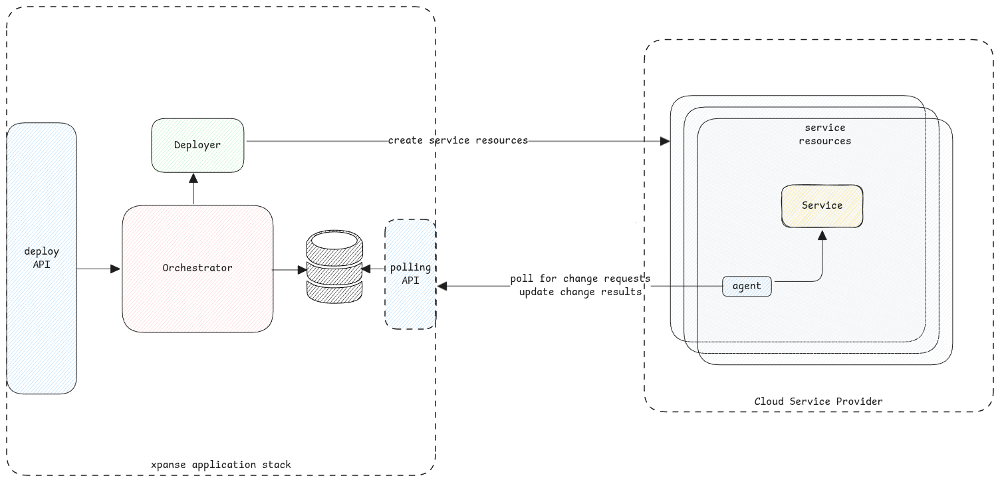

import Link from '../src/components/link/Link';

# Agent

<Link name={'xpanse agent'} url={'https://github.com/eclipse-xpanse/xpanse-agent'} /> is a Go based application that can
be deployed on the service's compute resources to communicate with the xpanse controller.

:::important Pull Agent
xpanse Agent is implemented with a pull mechanism since the xpanse controller in both

<Link name={'modes'} url={'./modes'} /> can't reach the compute nodes which is running on a completely different private
network.

:::

The agent is planned to take over all activities that needs to be performed on the service application after the
service is created. Some examples include

1. Update application configuration
2. Perform actions on the application - for example, create users on a database service.
3. Perform backup of service data and configuration.
4. and many more.

## Agent as System Service

It's recommended to install the xpanse agent as a system service on the compute node so that the agent is always started.

Example of how to do it can be found <Link name={'here'} url={'https://github.com/eclipse-xpanse/xpanse-agent/tree/main/scripts'}/>.

## Supported Use cases

The following use cases are currently supported by the agent.

### Update Application configuration

The application configuration management is based on Ansible.
Agent wraps the GIT and Ansible client to execute the whole process.

:::tip Agent for containerized solutions
The same agent can also be used for containerized solutions by deploying it in the same network where the other
containers are reachable.

In case of Kubernetes, it can be in the same POD as the application container.
:::
