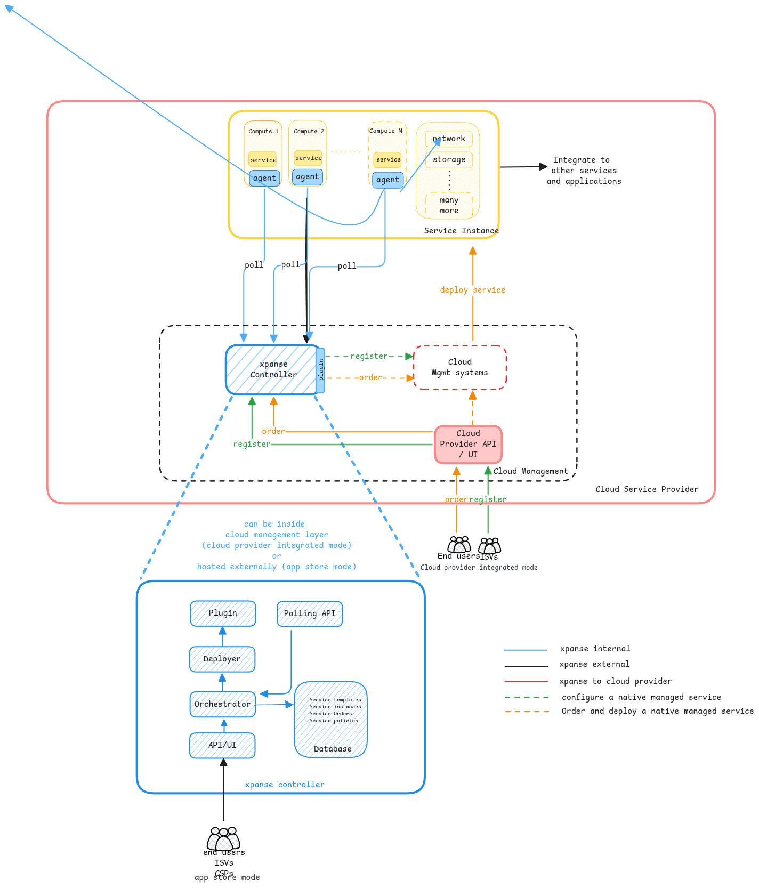
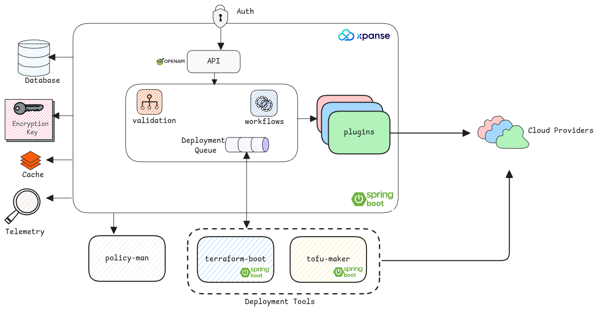

import Link from '../src/components/link/Link';

# Architecture

xpanse provides a highly configurable and easily extendable architecture to ensure the framework can be
used in different contexts and also be used in different possible <Link name={'modes'} url={'./modes'} />.

- **API** - <Link name={'REST APIs'} url={'./api'} /> which exposes all functionalities of xpanse.
- **UI** - An optional <Link name={'GUI'} url={'./ui'} /> for xpanse which is just wrapper for the API.
- **Orchestrator** - Main component, which manages the full life cycle of service templates and the deployed service instances.
- **Deployer** - Manages <Link name={'service deployments'} url={'./service-deployment'} />.
- **Plugin** - Implements integrations to cloud provider's management systems necessary to offer a native fully managed service.
- **Database** - Stores <Link name={'service templates'} url={'./configuration-language'} />, service instances, <Link name={'service policies'} url={'./policies'} /> and service orders. See <Link name={'databases'} url={'./databases'} /> page for more details.
- **Agent** - This runs on the compute resources of the service. <Link name={'Agents'} url={'./agent'} /> poll the controller for any service configuration state changes requested
  by the user and executes it.

## Runtime

The xpanse runtime is the glue between all components.
It's a spring-boot application that bundles all the modules mentioned above into an executable jar.

## xpanse Stack

The xpanse runtime also needs other systems for it to fully function in a production setup.

| Component      | Description                          |
| -------------- | ------------------------------------ |
| Database       | RDBMS based persistence layer        |
| terraform-boot | Asynchronous Terraform deployer      |
| tofu-maker     | Asynchronous OpenTofu deployer       |
| policy-man     | OPA based policy validation engine   |
| zitadel        | Authentication and authorization     |
| UI             | ReactJS based user interface         |
| Redis Cache    | Used for all caching functionalities |

