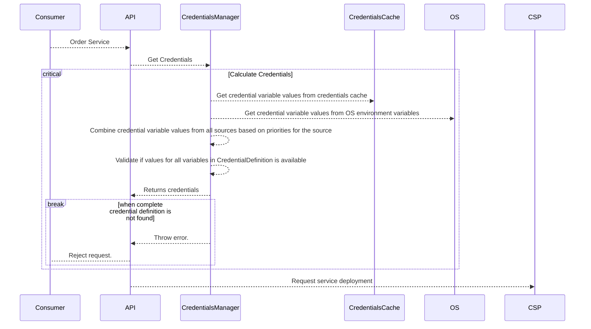
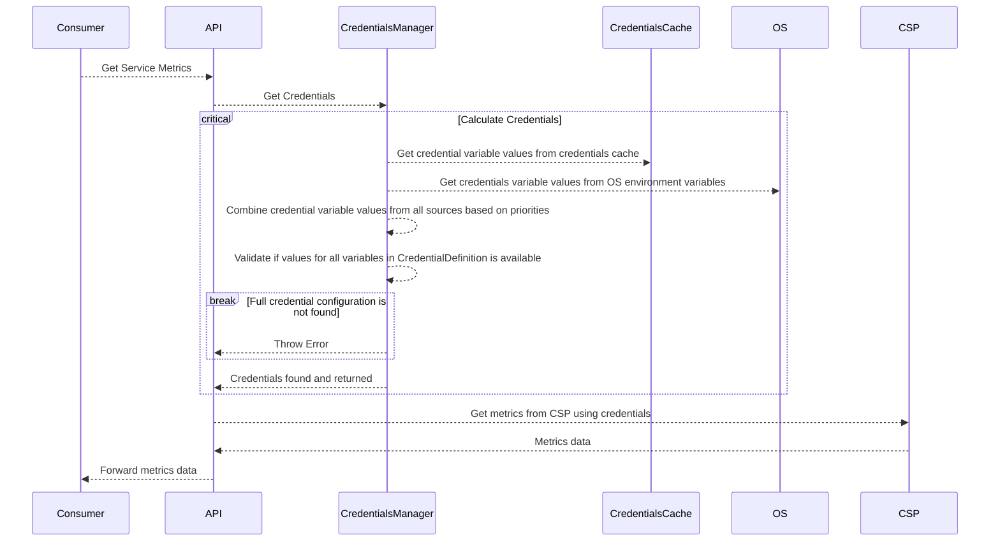

import Link from '../src/components/link/Link';

# Cloud Provider Credentials

Since xpanse runtime integrates with multiple cloud APIs, there is a need to define how and which credentials are used
by xpanse for each of the cloud providers.

## Authentication Capabilities

Each cloud provider allows different ways for its clients to authenticate itself and consume its API.
For example, the same CSP might support username/password, API key, Oauth2 etc., as possible ways to connect to its API.

While xpanse plugins are responsible for integrating with the cloud provider APIs,
it might not have implemented all possible ways to authenticate itself to the cloud provider API.

Every xpanse Plugin will define the authentication methods it supports to connect to its underlying cloud provider.
This configuration is added and exposed by implementing
the <Link name={'AuthenticationCapabilities'} url={'https://github.com/eclipse-xpanse/xpanse/blob/main/modules/orchestrator/src/main/java/org/eclipse/xpanse/modules/orchestrator/credential/AuthenticationCapabilities.java'}/>
interface by the corresponding plugin.

The same information is also made available to consumers via the REST API
method `getCredentialCapabilitiesByCsp`
in the CredentialsApi, which returns all credential types defined and supported by the plugin.

This list is enhanced as and when xpanse plugin for a specific CSP adds integration for new authentication methods
supported by the CSP APIs.

### Credential Configuration

Each credential configuration defined by a plugin contains the following information

1. Credential Type: variables, username/password, API key, Oauth2 etc.
2. Dependent configuration: In case of Variables, the variable names and its values that must be provided so that the
   plugin can connect to the respective cloud provider.

### Credential Type - Variables

This is the only type that's currently implemented in xpanse. This will be extended in the near future.

#### Credential Variable Value Sources

After a plugin has defined `credential Type` as `variables` and its respective variable names, then the consumer of this
cloud provider, then values for these variable names must be provided, and this is possible to be done from different
variable sources.

This is necessary to allow all combinations where some credential variable values are fixed for an environment
and some can be different for each user.
For example, in the case of Openstack plugin, the Identity URL might be fixed for each
xpanse instance, but the username and password can vary for each xpanse user.

###### xpanse User Specific Credentials

A credential for combination of a specific CSP, `CredentialType` and a specific xpanse user can be added using
the `addCredential` API method.
This means for all services ordered by a xpanse user or for monitoring services which are ordered by this
specific xpanse user, this added credential will be used.

This exact request body definition for each of the CSP and Credential Types can be found
using `getCredentialOpenApi`.
This method provides a link to OpenAPI definition and sample request for adding credentials for each CSP.

Credential variable values sent from this API are stored directly into <Link name={'CredentialCache'} url={'./cloud-provider-credentials#credential-cache'} isOpenInNewTab={false}/>.

###### OS Environment Variables

Based on the `CredentialDefinition` configured in the Plugins, the xpanse runtime can be started by injecting default
credential configuration variables as OS environment variables to the runtime. If values for all credential variables
aren't available from other sources, then the runtime will search for credential variables from OS environment
variables.

Please note that the variables from OS environment values are read as-is. It's therefore necessary to keep credential
variable names unique even between two different credential types of the same CSP.

#### Credential Variables "Joining"

As described in the above sections, for each credential type, a certain set of variables are defined. Values for **all**
of these variables are needed for the credential to be valid.

We join credential variable values from all the sources
mentioned in the <Link name={'above sections'} url={'./cloud-provider-credentials#credential-variable-value-sources'}/>
to get the final credential variable values that will be used for connecting to the CSP.

Credential values are read from different values and **joined** into one single set of all required credential variable
values of a given type.

If the value of a credential variable is available in multiple sources, then the value coming from the source of higher
priority is used.

###### Service Deployment

During the service deployment, all the values for the variables defined in the `CredentialDefinition` is derived from
different sources in a priority sequence provided below

1. CredentialType and variables from deploy variables.

    As part of the registering services, the service provider can define what type of credentials is needed for ordering
    the service.
    The end user must add this credential using `addCredential` method.
    This will add credentials to <Link name={'CredentialsCache'} url={'./cloud-provider-credentials#credential-cache'} isOpenInNewTab={false}/>.

2. Credential variable values from OS environment variables.

###### Service Monitoring

During the service monitoring, all the values for the variables defined in the `CredentialDefinition` is derived from
different sources in a priority sequence provided below

1. Credentials available in the <Link name={'CredentialsCache'} url={'./cloud-provider-credentials#credential-cache'} isOpenInNewTab={false}/>.
2. credential variables from OS environment variables.

## Credential Cache

Credential cache is the credential store in xpanse runtime which stores all credential data which are required to be
used in the later phase of the workflows.
Credentials provided by the <Link name={'API'} url={'./cloud-provider-credentials#xpanse-user-specific-credentials'} isOpenInNewTab={false}/> are stored as an in-memory cache map.

### Cache Eviction

Credentials are evicted from cache after the provided expiry time or by default after 1 hour.

### Data Encryption

When the runtime is started with an AES secure key, then all sensitive data is encrypted and stored in the JVM.
More information can be found <Link name={'here'} url={'https://github.com/eclipse-xpanse/xpanse#sensitive-parameters-handling'}/>.

### Multiple Credentials Found

When multiple credentials are found in the credential cache for the same xpanse user, credential type, and CSP, then we
simply use the first available credential.
