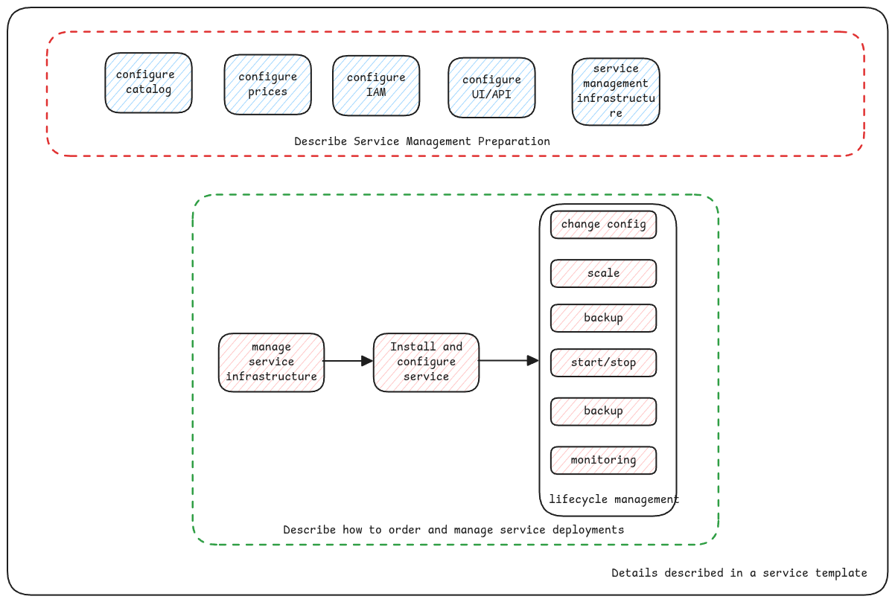
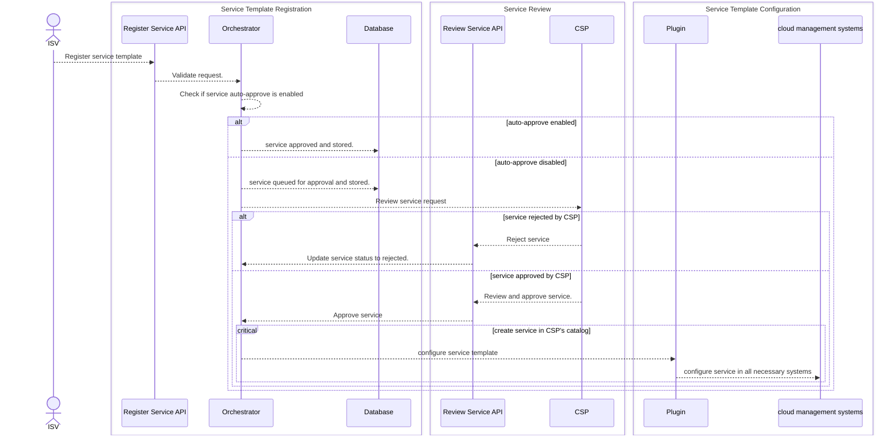

import Link from '../src/components/link/Link';

# Configuration Language

A native fully managed service is described using xpanse Service Description Language
(XSDL).

:::important XSDL and OCL
In the documentation and discussions, XSDL is sometimes also synonymously referred as OCL.
OCL is Open Services Cloud Configuration Language.

Since XSDL was implemented based on the initial implementation of OCL,
these two terms are still interchanged.

:::
XSDL is a YAML based description language which fully describes the service
with the details necessary to configure cloud management systems to offer the service as a native fully managed service
and the way to deploy and manage full life-cycle of the service.

:::tip Samples
Examples of managed services described using XSDL for multiple clouds can be found in the <Link name={'samples repository'} url={'https://github.com/eclipse-xpanse/xpanse-samples/tree/main'} />.

:::

### Deployment Scripts

In XSDL, the deployer can contain the script that must be executed for provisioning the managed service.
Currently, the only allowed script is Terraform.

### Flavors

For each managed service, we can define different flavors of it. For example, different sizes of the VM, etc. End user
can then select the flavor of their preference for the service while ordering.

### Flavor properties

Flavors can have properties which can be simply declared and referred in the deployment script too with the same
property names. Runtime will ensure that these variables are automatically available for the deployment scripts

### Deployment Variables

As part of the XSDL, the managed service provider can define variables that can be either entered by the user or
available as defaults or variables that can be read for any other sources such as the environment variables. All possible types of variables are defined
here <Link name={'Deployment Variables'} url={'https://github.com/eclipse-xpanse/xpanse/blob/main/modules/models/src/main/java/org/eclipse/xpanse/modules/models/servicetemplate/DeployVariable.java'}/>
The variables can then be used in the deployment scripts.

### Availability Zones

XSDL provides a way to define if the service supports deploying on availability zones which the end user wishes.

Or even if the service needs the end user to select multiple availability zones, even that's possible. The availability zone information can be directly injected into deployment scripts.

### ISV Contact Details

Each ISV can provide their support contacts as part of XSDL. This can then be used by end user or the CSP in case of issues with the service deployment or managing the service after deployment.

## Register Service templates

xpanse provides different options to register service templates defined using XSDL:

- REST API on the xpanse runtime
- xpanse UI

### Service Template Registration Sequence

