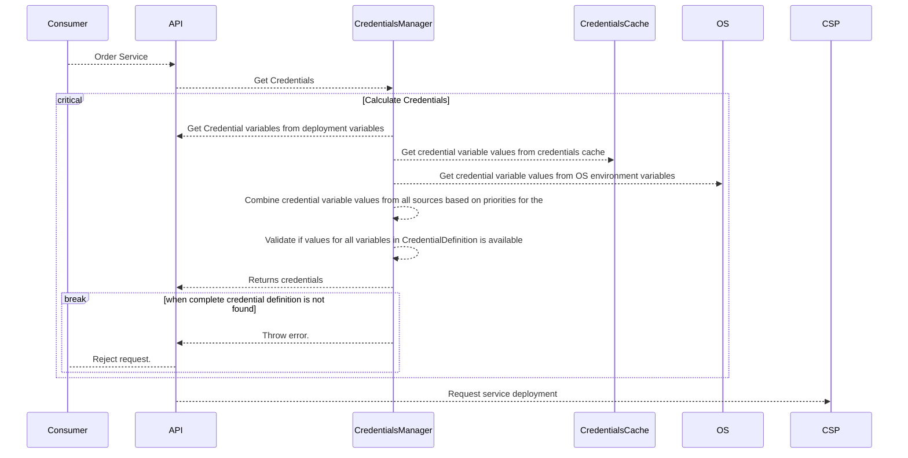
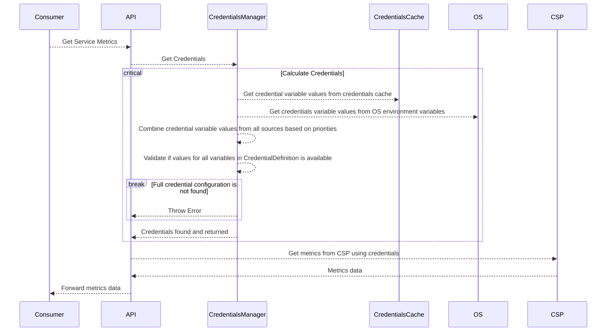

# Credentials Concept

Since Xpanse runtime integrates with multiple cloud APIs, there is a need to define how and which credentials are used
by Xpanse for each of the cloud provider.

## Authentication Capabilities

Each CSP allows different ways for its clients to authenticate itself and consume its API. For example, the same CSP
might support username/password, API key, Oauth2 etc., as possible ways to connect to its API.

While Xpanse plugins are responsible for integrating wih the CSP APIs, it might not have implemented all possible ways
to authenticate itself to the CSP API.

Every Xpanse Plugin will define the authentication methods it supports to connect to its underlying CSP. This
configuration is added and exposed by implementing
the [AuthenticationCapabilities](https://github.com/eclipse-xpanse/xpanse/blob/main/modules/credential/src/main/java/org/eclipse/xpanse/modules/credential/AuthenticationCapabilities.java)
interface by the corresponding plugin.

The same information is also then made available to consumers via the REST API
method [getCredentialCapabilitiesByCsp](https://eclipse-xpanse.github.io/xpanse-website/docs/api/#tag/Credentials-Management/operation/getCredentialDefinitionsByCsp)
in the CredentialsApi which returns all credential types defined and supported by the plugin.

This list is enhanced as and when Xpanse plugin for a specific CSP adds integration for new authentication methods
supported by the CSP APIs.

### Credential Configuration

Each credential configuration defined by a plugin contains the following the information

1. Credential Type - username/password, API key, Oauth2 etc.
2. Variables that must be filled with values for the plugin use the credential to connect to CSP.

## Credential Variable Value Sources

After a plugin has defined the credential possibilities and its respective variable names, values for these variable
names must be provided and this is possible to be done from different sources.

This is necessary to allow combinations where some credential variable values are fixed for an environment and some can
be different for each user. For example, in case of Openstack plugin, the Identity URL, Project might be fixed for each
environment but the username and password can vary for each Xpanse user.

### Deployment Variables

Credential variables can be passed as part of the deployment variables during service ordering. If credential type is
not passed, then we simply use the first available credential definition of the CSP and try to find values for its
variables from deployment variables.

This credential value source is only used for service deployment use case.

Note - We might in future change credential configuration to a separate section in the Xpanse service description. This
is to be discussed.

### Xpanse User Specific Credentials

A credential for combination of a specific CSP, `CredentialType` and a specific Xpanse user can be added using
the [addCredential](https://eclipse-xpanse.github.io/xpanse-website/docs/api/#tag/Credentials-Management/operation/addCredential)
API method. This means, for all services ordered by a Xpanse user or for monitoring services which are ordered by this
specific Xpanse user, this added credential will be used.

This exact request body definition for each of the CSP and Credential Type can be found
using [getCredentialOpenApi](https://eclipse-xpanse.github.io/xpanse-website/docs/api/#tag/Services-Available/operation/getCredentialOpenApi).
This method provides a link to OpenAPI definition and sample request for adding credentials for each CSP.

Credential variable values sent from this API is stored directly into [CredentialsCache](#credentials-cache)

### OS Environment Variables

Based on the `CredentialDefinition` configured in the Plugins, the Xpanse runtime can be started by injecting default
credential configuration variables as OS environment variables to the runtime. If values for all credential variables
are not available from other sources, then the runtime will search for credential variables from OS environment
variables.

Please note that the variables from OS environment values are read as-is. It is therefore necessary to keep credential
variable names unique even between two different credential types of the same CSP.

## Credentials "Joining"

As described in the above sections, for each credential type, a certain set of variables are defined. Values for **all**
of these variables are needed for the credential to be valid.

We join credential variable values from all the sources mentioned in the [above sections](#credential-value-sources) to
get the final credential variable values that will be used for connecting to the CSP.

Credentials values are read from different values and **joined** into one single set of all required credential variable
values of
a given type.

If value of a credential variable is available in multiple sources then the value coming from the source of higher
priority is used.

### Service Deployment

During the service deployment, all the values for the variables defined in the `CredentialDefinition` is derived from
different sources in priority sequence provided below -

1. CredentialType and variables from deploy variables.

    As part of the registering services, the service
    provider can define the service such that the end user can provide the values for the required credential variables
    defined in the `CredentialDefinition` while ordering the service.)

2. Credentials available in the [CredentialsCache](#credentials-cache).
3. Credential variable values from OS environment variables.

### Service Monitoring

During the service monitoring, all the values for the variables defined in the `CredentialDefinition` is derived from
different sources in priority sequence provided below -

1. Credentials available in the [CredentialsCache](#credentials-cache).
2. credential variables from OS environment variables.

## Credentials Cache

Credentials cache is the credential store in Xpanse runtime which stores all credential data.

Credentials provided by the [API](#adding-xpanse-user-specific-credentials) are stored as in-memory cache map. This is
safe since no data is stored in the disk and the map is also not exposed outside the application.

Credentials are evicted from cache after the provided expiry time or by default after 1 hour.

## Multiple Credentials Found

When multiple credentials are found in the credentials cache for the same Xpanse user, credential type and CSP, then we
simply use the first available credential.
