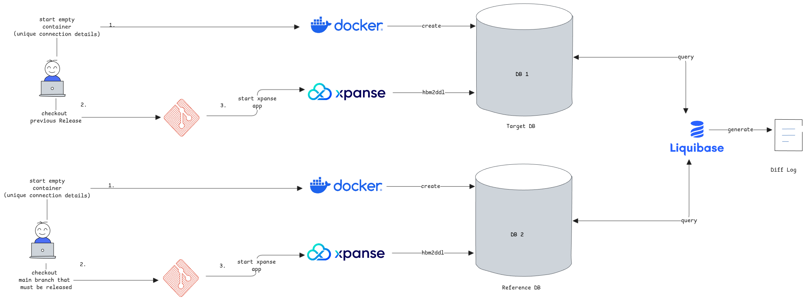

# Database Schema Evolution

import Link from '../src/components/link/Link';

<!-- vale off -->

xpanse uses <Link name={'Liquibase'} url={'https://www.liquibase.com/'}/> framework to manage the database schema evolution of xpanse.

<!-- vale on -->

## Use of hdm2ddl library

Spring Boot uses Hibernate framework's **hdm2ddl** which does the following

1. Automatically generate DDL statements based on Entity classes available in the classpath.
2. Execute DDL statements automatically at the server start.

This feature is used in xpanse by default for development purposes and
also additionally to prepare a database with all necessary database objects automatically and
then use it for generating Liquibase SQL change scripts for the respective release.

:::tip hdm2ddl for schema evolution process
We use hdm2ddl for schema evolution in order to simplify the process of generating SQL scripts.
The developer need not write SQL scripts. Instead, we let hdm2ddl to generate the scripts and prepare the release preparation database and
then use Liquibase's feature to auto generate DDL SQL statements based on the database structure.
:::

:::danger Manual Process
The schema generation process isn't fully automated to ensure the changes are verified by the developer before the release is done.

Even though we use Hibernate and Liquibase to generate changes, the developer must still validate the changes generated.
This is also the recommended best practice from Liquibase.
:::

## Release preparation

When a xpanse release is planned, the developer must prepare the repository with the necessary change scripts using the steps below.
The scripts must be pushed and merged to the **main** branch, and only then the release job must be executed. s

There are always two sets of changes to be prepared for each release of xpanse.

1. **Full Release Change Log—**This is used when the xpanse release will be installed on a fresh and empty database.
2. **Update change log—**This contains only the difference between the new release and the previous releases.

:::info H2 database scripts included
Even though H2 database is used for development purposes, we also deliver SQL scripts for it just for completeness.
:::

### Prepare Full Release Snapshot


### MySql

1. Clone the forked xpanse repository. Ensure the fork is fully in sync with the upstream.
2. Checkout a feature branch from `main` branch.
3. Start a new MySql database container.
4. Start xpanse with `mysql` profile. Let hbm2ddl create all necessary database objects.
5. Run Liquibase's maven plugin to generate the full release snapshot of the database schema.
6. Rename the generated file name.

```shell
# Start MySql Container
docker run --name mysql-db -p 3306:3306 -e MYSQL_PASSWORD=Xpanse@2023 -e MYSQL_ROOT_PASSWORD=Xpanse@2023 -e MYSQL_DATABASE=xpanse -e MYSQL_USER=xpanse -d mysql:latest

# Start Application with mysql spring profile

# Run Liquibase maven plugin
cd modules/database
mvn liquibase:generateChangeLog -Dliquibase.properties.file=src/main/resources/liquibase/liquibase.mysql.properties

# Rename the generated src/main/resources/liquibase/full/mysql/xpanse-REPLACE_NEW_RELEASE-full.mysql.sql file name.
# Replace REPLACE_NEW_RELEASE value in the file name with the next planned release value.
```

### H2

1. Clone the forked xpanse repository. Ensure the fork is fully in sync with the upstream.
2. Checkout a feature branch from `main` branch.
3. Delete existing H2 DB files from your local file system.
4. Start xpanse with default profiles that enable H2 database. Let hbm2ddl create all necessary database objects.
5. Stop the application. Otherwise, Liquibase can't connect concurrently to the H2 database files while the application is also running.
6. Run Liquibase's maven plugin to generate the full release snapshot of the database schema.
7. Rename the generated file name.

```shell
# Start Application with default profiles.

# Run Liquibase maven plugin
cd modules/database
mvn liquibase:generateChangeLog -Dliquibase.properties.file=src/main/resources/liquibase/liquibase.h2.properties

# Rename the generated src/main/resources/liquibase/full/h2/xpanse-REPLACE_NEW_RELEASE-full.h2.sql file name.
# Replace REPLACE_NEW_RELEASE value in the file name with the next planned release value.
```

### Prepare upgrade to a release

This step is necessary to generate the changes necessary to upgrade a database running on a previous version of the schema
to the new version of the schema.



#### MySql

**Step 1 -** Prepare the last released DB Schema. This represents the 'is' state of the schema.

1. Clone the xpanse upstream repository and checkout GIT `tag` of the previous released version.
2. Start a new MySql database container with port
3. Start xpanse with `mysql` profile. Let Hibernate create all necessary database objects.
4. Stop the application.

```shell
# Clone the upstream repository and checkout the tag.
# Forked repositories will not work.
git clone https://github.com/eclipse-xpanse/xpanse.git
git checkout $vX.X.X

# Start MySql Container
cd modules/database/src/main/resources/liquibase/
docker run --name mysql-db-current -p 3306:3306 -e MYSQL_PASSWORD=Xpanse@2023 -e MYSQL_ROOT_PASSWORD=Xpanse@2023 -e MYSQL_DATABASE=xpanse -e MYSQL_USER=xpanse -v ./init.sql:/docker-entrypoint-initdb.d/init.sql:ro -d mysql:latest

# Start Application with mysql spring profile
```

**Step 2 -** Prepare the Reference DB Schema. This represents the 'to-be' state of the schema.

1. Clone the forked xpanse repository. Ensure the fork is fully in sync with the upstream.
2. Checkout a feature branch from the `main` branch.
3. Start a new MySql database container with another name and port.
4. Start xpanse with `mysql` profile and use the new database. Let Hibernate create all necessary database objects.
5. Stop the application.

```shell
# Start MySql Container from the forked repository and database folder
cd modules/database/src/main/resources/liquibase/
docker run --name mysql-db-latest -p 3307:3306 -e MYSQL_PASSWORD=Xpanse@2023 -e MYSQL_ROOT_PASSWORD=Xpanse@2023 -e MYSQL_DATABASE=xpanse -e MYSQL_USER=xpanse -v ./init.sql:/docker-entrypoint-initdb.d/init.sql -d mysql:latest

# update the application.mysql.properties file -
spring.datasource.url=jdbc:mysql://localhost:3307/xpanse
spring.activiti.datasource.jdbcUrl=jdbc:mysql://localhost:3307/activiti

# Start Application with mysql spring profile
```

**Step 3 -** Use Liquibase to compare these two databases and generate the difference change log.

1. Run the maven plugin command with the goal specified below.
2. Verify the changes generated by Liquibase.
3. Rename the file with correct release numbers.

```shell
# Run Liquibase maven plugin
cd modules/database
mvn liquibase:diff -Dliquibase.properties.file=src/main/resources/liquibase/liquibase.mysql.properties

# Rename the generated xpanse-upgrade-REPLACE_OLD_RELEASE-to-REPLACE_NEW_RELEASE.mysql.sql file name.
# Replace REPLACE_NEW_RELEASE value in the file name with the next planned release value.
# Replace REPLACE_OLD_RELEASE value in the file name with the previous released version.
```

#### H2

**Step 1 -** Prepare the last released DB Schema. This represents the 'is' state of the schema.

1. Clone the xpanse upstream repository and checkout GIT `tag` of the previous released version.
2. Delete all existing H2 database files.
3. Start xpanse with default profiles. Let Hibernate create all necessary database objects.
4. Stop the application.

```shell
# checkout git tag
spring.datasource.url=jdbc:h2:file:./xpanse-new;DB_CLOSE_ON_EXIT=FALSE
```

**Step 2 -** Prepare the Reference DB Schema. This represents the 'to-be' state of the schema.

1. Use the same cloned xpanse repository from step 1.
2. Checkout a feature branch from `main` branch.
3. Update spring.datasource.url to use another unique database file.
4. Start xpanse with default profiles. Let Hibernate create all necessary database objects.
5. Stop the application.

```shell
# update the application.properties file -
spring.datasource.url=jdbc:h2:file:./xpanse-new;DB_CLOSE_ON_EXIT=FALSE
```

**Step 3 -** Use Liquibase to compare these two databases and generate the difference change log.

1. Run the maven plugin.
2. Verify the changes generated by Liquibase.
3. Rename the file with correct release numbers.

```shell
# Run Liquibase maven plugin
cd modules/database
mvn liquibase:diff -Dliquibase.properties.file=src/main/resources/liquibase/liquibase.h2.properties

# Rename the generated xpanse-upgrade-REPLACE_OLD_RELEASE-to-REPLACE_NEW_RELEASE.h2.sql file name.
# Replace REPLACE_NEW_RELEASE value in the file name with the next planned release value.
# Replace REPLACE_OLD_RELEASE value in the file name with the previous released version.
```

:::important same process for generating upgrade from any release to new release
The steps mentioned above aren't only valid for upgrading just previous release to new release.
Same steps can be used to upgrade from any of the previous releases to new release.

Just the tag to be checked out must be changed based on the requirement.
:::

## Merging Change Log Files

Once the change log is generated and verified, a PR must be opened to merge these files into the main branch.
Only after this merge is completed, the new release can be done.

## Installing or Upgrading Database

The below maven command must be updated with the correct change log file and
then can be used to execute the upgrade scripts on the target database.

```shell
mvn liquibase:update \
    -Dliquibase.properties.file=src/main/resources/liquibase/liquibase.mysql.properties \
    -Dliquibase.changeLogFile=src/main/resources/liquibase/full/mysql/xpanse-upgrade-v1.0.0-to-v1.0.1.mysql.xml
```

:::danger double check file names
Most important parameter is the **changeLogFile**. This must be doubled checked before executing the command.
If we plan to execute multiple change log files, then the current sequence of change log files matter.
:::

## Design Decisions

1. Liquibase is available for many years and has better community support.
2. XML change log used—This is the oldest format in Liquibase and also the most stable one.
   Found some issues with SQL formatted change logs.

## Known Issues

1. If the **diff** generates a change in data type with the **modifyDataType** tag,
   then all constraints on such a column are lost.
   We must add the constraints back to the change log script. This is a MySQL only limitation.
