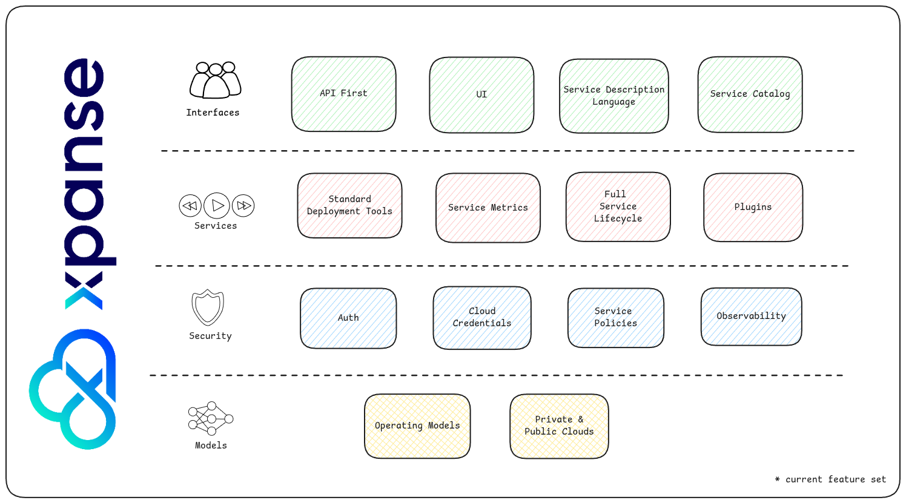

import Link from '../src/components/link/Link';

# Introduction

xpanse project creates a framework for software vendors to offer native managed services on cloud service providers.

**Native services** here refers to the services that are fully integrated into cloud provider's service catalog,
infrastructure, user interfaces and many other cloud management systems.
This means, xpanse will enable ISVs also to sell their services the same way CSPs do on their own cloud infrastructure.

**Fully Managed** means the entire life-cycle of the service is managed by the ISV.

The framework can work with public, private, hybrid clouds and host cloud services based on
virtual machines, bare metals or k8s cluster based services.

## Goals of the project

xpanse is a project aimed reshaping the cloud services ecosystem:

-   Everybody should be able to sell native fully managed services.
-   End users will have just one channel to buy services.
-   Standardize service definition process by creating a cloud-agnostic
    <Link name={'service configuration language'} url={'./configuration-language'} />.
-   Make service portability a default feature.

## Getting Started

To understand the project and its implementation better, refer to the

<Link name={'architecture'} url={'./architecture'} />,
<Link name={'modes'} url={'./modes'} /> and
<Link name={'service configuration language'} url={'./configuration-language'} />.

## Current Features

The current version of xpanse supports the following features

