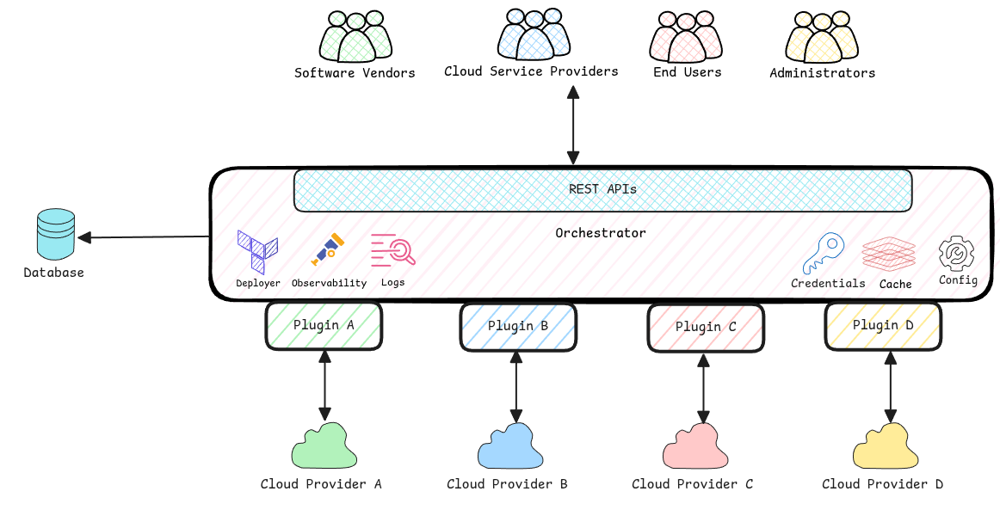

# Modes

xpanse doesn't have an opinionated implementation. It aims to provide a framework which is flexible
and has all building blocks necessary to use it in different contexts/modes.

Current possible modes of xpanse are **app store mode** and **cloud provider integration mode**.

### Cloud Provider Integrated Mode

In this mode, xpanse is deployed on the management zone of the specific cloud provider that supports xpanse.

With this mode, the services from software vendors are sold as full native managed services on that
cloud provider. The end user won't notice if the service is from an independent software vendor or from
the cloud provider itself.


### App Store Mode

In this mode, xpanse is deployed outside any specific cloud provider's management layer.
Using this mode, the service vendors can use the xpanse platform to sell services on any cloud providers
supported by xpanse.

The end user then uses this one stop-shop to consume services from the cloud provider of his choice.



## High-Level Sequence Diagram

A very high level happy-case service offering and service ordering via xpanse will look like below.

<div style={{width: '130%'}}>
<!-- prettier-ignore -->
```mermaid
    sequenceDiagram
    actor ISV
    actor CSP
    actor USER
    critical register service
        ISV -->> xpanse API/UI: Register service template.
        xpanse API/UI -->> orchestrator: Register service template.
        orchestrator --> database: Store service template in database with APPROVAL_PENDING status.
    end
    critical validate service
        CSP -->> xpanse API/UI: Validate and approve service.
        xpanse API/UI -->> orchestrator: Validate and approve service.
        orchestrator -->> database: Update service template status to APPROVED.
        orchestrator --> plugin: Prepare service for customer to order.
        plugin -->> cloud provider: Configure service in necessary cloud management systems.
    end
    alt order service - app store mode
        USER -->> xpanse API/UI: Order service from the catalog.
        xpanse API/UI -->> orchestrator: forward order request.
        orchestrator -->> deployer: Request service deployment as configured in the service template
        deployer -->> cloud provider: Create resources and configure service.
        deployer -->> orchestrator: Return endpoint details to reach the deployed service.
        deployer -->> xpanse API/UI: Return endpoint details to reach the deployed service.
        xpanse API/UI -->> USER: Return endpoint details to customer.
    else order service - cloud provider integrated mode
        USER -->> cloud provider: Order service from the catalog.
        cloud provider -->> orchestrator: Start deployment
        orchestrator -->> deployer: Request service deployment as configured in the service template
        deployer -->> cloud provider: Create resources and configure service.
        deployer -->> orchestrator: Return endpoint details to reach the deployed service.
        orchestrator -->> cloud provider: Return endpoint details to customer.
        cloud provider -->> USER: Return endpoint details to customer.
    end
    ```
</div>
