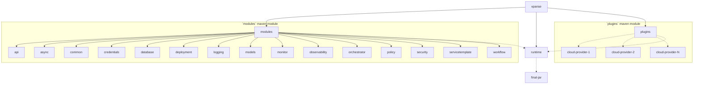

# Package Structure

The package structure of the xpanse application are as follows and must be strictly followed in all implementations.
xpanse uses `maven` as its build tool and the application is split into multiple smaller maven modules.

## modules

This maven module is a parent module for most of the other maven modules within xpanse.

#### `api`

Contains all the REST API controller classes and the exception handlers.

#### `async`

Contains all classes related to asynchronous processing configuration for different use cases within xpanse.

#### `common`

Contains generic and utility classes which are used by multiple different modules.

#### `credential`

contains all logic and caching for cloud provider credentials.

#### `database`

contains all entities, DB queries and JPA related code.

#### `deployment`

contains all code related to service deployment. All service deployers such Terraform, OpenTofu, etc are also implemented in this module.

#### `logging`

contains all code and configuration related to logging.

#### `models`

contains all data models and exceptions that are exposed externally in our APIs. All data models here are automatically exported in the OpenAPI doc.

:::important Avoid cyclic dependencies with **models** package
Ensure that this module doesn't have dependency to any other xpanse modules else it will result in cycle dependencies errors.

This package must not contain any internal data classes.
:::

#### `monitor`

contains all code related to fetching and caching service metrics for deployed services.

#### `observability`

contains all code related to observability and traceability of the xpanse stack.

:::tip monitoring vs observability packages
`monitor` module is for monitoring the customer's deployed clouds services whereas `observability` module is for monitoring the xpanse stack itself.
:::

#### `orchestrator`

This package is the central package for orchestrating service deployment, monitoring, cloud provider credentials, service state management.
It also has all the internal data models used by xpanse for all use-cases.

#### `Policy`

This package contains all code related to OPA policy validation. Also, the policy-man REST client is part of this package.

#### `security`

This package contains all code and configuration related to security within xpanse.
It contains the Oauth2 security of xpanse APIs and also the encryption of sensitive order data.

#### `servicetemplate`

contains all code for managing service templates.

#### `workflow`

contains all code and configuration related to managing Activiti workflow engine.

## plugins

contains all cloud provider specific integrations. Under plugins maven module, there is one submodule for each cloud provider supported by xpanse.

## runtime

This is the package which contains the main spring boot class and also pulls all other maven modules listed above as dependencies to generate the final jar.
