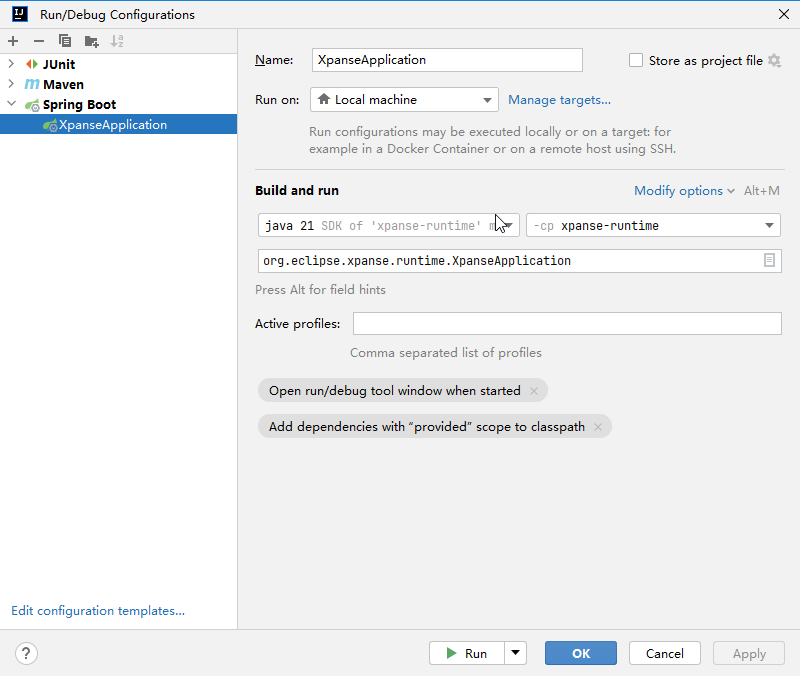

import Link from '../src/components/link/Link';

# Runtime

xpanse runtime is the running module built on SpringBoot.

`xpanse Runtime` supports two kinds of deployers: terraform and open tofu.

`xpanse Runtime` has two ways to invoke `terraform`, one is to use the local terraform module, the other is use
the remote terraform-boot service. The remote terraform-boot service is used by default.

Similarly, `xpanse Runtime` has two ways to invoke `open tofu`, one is to use the local open tofu module,
the other is use the remote terraform-boot service. The remote terraform-boot service is used by default.

## Pre-Requisites

1. If using local terraform module, the `xpanse Runtime` host must have `Terraform CLI` installed.

2. If using remote terraform-boot service, a remote `terraform-boot` service must be
   deployed/started. More details about the Terraform-boot project can be found <Link name={'here'} url={'https://github.com/eclipse-xpanse/terraform-boot/blob/main/README.md'} />.

3. If using local open tofu module, the `xpanse Runtime` host must have `Open Tofu CLI` installed.

4. If using remote terraform-boot service, a remote `tofu-maker` service must be
   deployed/started. More details about the Terraform-boot project can be found <Link name={'here'} url={'https://github.com/eclipse-xpanse/tofu-maker/blob/main/README.md'} />.

5. Fully configured Zitadel instance.

## Properties and Environment Variables

xpanse has integration to multiple systems, and the aim is also to keep the system as flexible as
possible and to cover all use-cases possible. Therefore, there are some configuration properties
that the developer and the production administrators must take care of before starting/deploying
xpanse.

1. Configuration properties of authentication layer.
   Documented <Link name={'here'} url={'./authentication-authorization'} isOpenInNewTab={false}/>.
2. Configuration properties of database layer. Documented <Link name={'here'} url={'./database#mysql-db'} isOpenInNewTab={false}/>.
3. Plugin activation variables. Documented <Link name={'here'} url={'./plugins#plugin-activation'} isOpenInNewTab={false}/>.

### Local Development

#### Clone and Build

Clone the project using the command below

```shell
$ git clone https://github.com/eclipse-xpanse/xpanse
$ cd xpanse
```

Then compile the entire project using the below command:

```shell
$ ./mvnw clean install -DskipTests
```

By default, the compile process will enable all plugins supported by xpanse. If you want to enable a specific plugin,
add the flag `-Pplugin-xxx` in the command line to enable the specific plugin.

```shell
$ ./mvnw clean install -DskipTests -Pplugin-huawei
```

The specific plugin profile in the flag `-Pplugin-xxx` can enable the plugin for the cloud service provider as below:

`-Pplugin-huawei` to enable the plugin for HUAWEI CLOUD.
`-Pplugin-flexibleengine` to enable the plugin for Flexible Engine Cloud.
`-Pplugin-openstack` to enable the plugin for Openstack Cloud.
`-Pplugin-scs` to enable the plugin for SCS Cloud.

#### Run

Ensure all properties mentioned in the <Link name={'above section'} url={'./runtime#properties-and-environment-variables'} isOpenInNewTab={false}/> are
correctly set.

##### From Command Line

If you have a fully configured Zitadel instance running on your local system, then you can use the
below command to start the application by passing all variables.

To start the application from the command line, run the below application from the root of the
project.

```shell
$ java -jar runtime/target/xpanse-runtime-1.0.8-SNAPSHOT.jar
```

:::danger Plugins in runtime
If the executable jar packaged with the specific plugin profile, the running service only supports the specific
cloud service provider.
:::

```properties
spring.profiles.active=oauth,zitadel,zitadel-testbed,terraform-boot,tofu-maker
```

By default, `xpanse Runtime` starts with our `zitadel-testbed`. If you would not like to use our `zitadel-testbed`,
you can start the server using the below command by update the `spring.profiles.active` property and with all the required variables.

```shell
$ cd runtime/target
$ java -jar runtime/target/xpanse-runtime-1.0.8-SNAPSHOT.jar \
--spring.profiles.active=oauth,zitadel,terraform-boot,tofu-maker
--authorization-api-client-id=${client-id} \
--authorization-api-client-secret=${client-secret} \
--authorization-swagger-ui-client-id=${swagger-ui-cleint-id}
```

By default, `xpanse Runtime` starts with terraform-boot and tofu-maker. If you want to use local terraform and
local open tofu, just don't activate the terraform-boot and tofu-maker scenario in the application.properties
configuration file. Use the below start command line with the value of the property `spring.profiles.active`
removed the profile flag `terraform-boot` and `tofu-maker`.

```shell
$ java -jar runtime/target/xpanse-runtime-*-SNAPSHOT.jar \
--spring.profiles.active=oauth,zitadel,zitadel-testbed
```

##### From IDE

Or the application can be started using the IDE by executing the main application directly. Below is
the example from IntellijIdea



You must see the below messages in the console.

```shell

   _  __   ____    ____ _   ____    _____  ___
  | |/_/  / __ \  / __ `/  / __ \  / ___/ / _ \
 _>  <   / /_/ / / /_/ /  / / / / (__  ) /  __/
/_/|_|  / .___/  \__,_/  /_/ /_/ /____/  \___/
       /_/

        xpanse 1.0.8-SNAPSHOT (2023)
11:33:13.144 [main] INFO  o.e.xpanse.runtime.XpanseApplication []- Starting XpanseApplication using Java 21.0.1 with PID 9440 (D:\IdeaProjects\xpanse\runtime\target\classes started by Administrator in D:\IdeaProjects\xpanse)
11:33:13.146 [main] INFO  o.e.xpanse.runtime.XpanseApplication []- The following 5 profiles are active: "zitadel", "zitadel-testbed", "terraform-boot", "tofu-maker"
11:33:23.783 [main] INFO  o.e.x.m.orchestrator.PluginManager []- List cloud service providers:[SCS, HUAWEI, FLEXIBLE_ENGINE, OPENSTACK] with activate plugins.
11:33:23.793 [main] INFO  o.e.x.m.s.IdentityProviderManager []- Identity provider service with type:ZITADEL is active.
11:33:29.116 [main] INFO  o.e.xpanse.runtime.XpanseApplication []- Started XpanseApplication in 16.584 seconds (process running for 17.701)
```

You can check the status of the runtime by opening the swagger UI from any browser:

```
http://localhost:8080/swagger-ui/index.html
```

### Production

Ensure all properties mentioned in the <Link name={'above section'} url={'./runtime#properties-and-environment-variables'} isOpenInNewTab={false}/> are
correctly set.

#### Run using jar

Download the released runtime jar from GitHub releases. You can get the latest from <Link name={'here'} url={'https://github.com/eclipse-xpanse/xpanse/releases/latest'}/>.

After downloading, follow the same steps mentioned in <Link name={'this'} url={'runtime#from-command-line'}/> section.

#### Run using Docker image

You can start the runtime using our released docker image, and this is the preferred way. This image
contains all necessary tools preinstalled.

```shell
$ docker pull ghcr.io/eclipse-xpanse/xpanse:${release-version}
$ docker run -d -p 8080:8080 --name xpanse -e "SPRING_PROFILES_ACTIVE=oauth,zitadel,mysql" ghcr.io/eclipse-xpanse/xpanse:${release-version}
$ docker logs xpanse
```

:::danger Avoid properties in command line
It's safe to provide all properties as environment variables rather than passing them directly in the command line.
In case of this, the same property name must be set in UPPERCASE for all 4 variables.
For running, using docker image, we can use the ` --env-file` option of the `docker run` command to store all sensitive data.
Again here the property names must be in UPPERCASE.
:::

#### Running API behind a proxy

For running the runtime application behind a proxy, we must ensure that the proxy forwards the
correct `X-Forwarded-*`headers to the API. This is necessary as the API has some features where the
links to HTML pages are returned and this link will have the correct protocol and host only when
these headers are set.

In the case of NGINX, the configuration will look like this

```nginx configuration
proxy_set_header X-Forwarded-For $proxy_add_x_forwarded_for;
proxy_set_header X-Forwarded-Proto https;
proxy_set_header Host $host;
```
