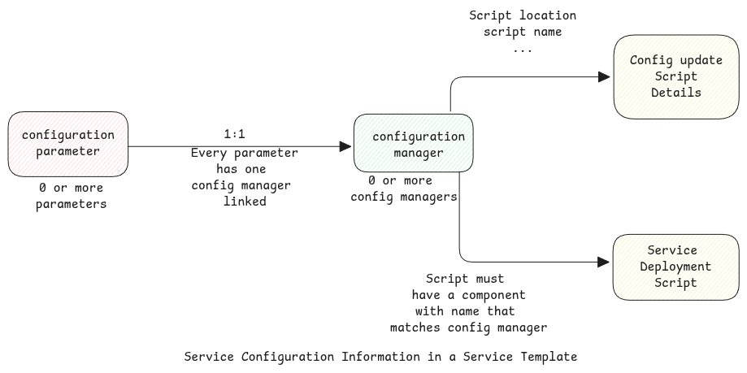

import Link from '../src/components/link/Link';

# Service Configuration

Service configuration refers to the application configuration parameters that control the behaviour of the service.

In xpanse, such configuration parameters which that can be changed by the end user must be exposed by the ISV in the
corresponding service template and also provide necessary scripts to update the configuration.


## Service Configuration Details in Service Template

Services that would like to allow end users to change service configuration after the service is deployed must provide
the following information in the service template.



### Configuration Managers

Configuration manager is nothing but a compute **component** in the service deployment.

:::tip Example of Configuration Manager
In case of a service like Kafka, it consists of multiple components such as zookeeper and broker,
So the configuration manager in this case can either be zookeeper or broker.
:::

For every configuration manager, the ISV must declare the location of the scripts, the script name, dependencies, etc
in the service template.

### Configuration Parameters

Configurable service parameters must be listed in the service template. For each configuration parameter,
details such as name, description, default, value, configuration manager name (see above) must be provided.

:::important Relation between configuration parameter and manager

1. A service template can have 0:N configuration parameters.
2. For each configuration parameter, there must be 1:1 configuration manager.
3. For each service that multiple parameters, there must be 1:N configuration managers.
   :::

### Single Configuration Manager

For the below use cases, there would be just one single configuration manager.
All configuration parameters in the service template will refer to this single configuration manager.

-   When the service contains only one component. Example a simple database that runs inside a single VM.
-   When the service contains multiple components but the configuration update script is implemented in such a way
    that it just executes on component, and it automatically connects to other components to update changes.
-   When the service contains multiple components but only central component such as `etcd` manages configuration
    for all components.

## Configuration Manager in Deployment Script

Since a configuration manager is just a component in the service deployment itself,
we must ensure that service deployment script creates a component with this name.
Otherwise, the service template validation will fail.

:::info Configuration manager in HCL
When we define the deployment script using HCL which is used by Terraform and OpenTofu deployers,
the name of the configuration manager must also be the label assigned to the compute resource of that service component.

In the below example, "zookeeper" can be used as a valid configuration manager in the service template

```terraform
    resource "openstack_compute_instance_v2" "zookeeper" {
    availability_zone  = local.availability_zone
    name               = "ecs-tf-${random_id.new.hex}"
    flavor_name          = var.flavor_name
    security_groups    = [ local.secgroup_name ]
    image_id           = data.openstack_images_image_v2.image.id
    admin_pass         = local.admin_passwd
    network {
    uuid = local.vpc_id
    }
  }
```

:::

### Agent Installation

Every component which is also acts as a configuration manager,
must install the xpanse agent as part of its resource creation.

Read more about xpanse agents <Link name={'here'} url={'./agent'} />.

## runOnlyOnce Parameter

**runOnlyOnce** parameter is used to define when multiple instance of a **component** of the service exists but
the configuration update should be executed on only one of them.

This means the configuration change will be

1. either be automatically synced to other instances of the component or
2. the configuration update job on one instance connects to all other instances and
   makes the necessary configuration changes.

## Default Configuration

When the service is first created, the default value of each of the configuration parameter is stored as the current
configuration of the service in the xpanse database. Any further changes to the configuration of the service will be
based on this default configuration.

## Supported Configuration Update Tools

Currently, Ansible is supported as a configuration update tool.
This means, ISVs must implement one Ansible playbook for each configuration manager.

### Ansible Code Location

All Ansible code must be stored in a GIT repository and the repository must be reachable from the

:::info Future plans
The plan is to allow to download the scripts from locations other than GIT repositories in future releases.
:::

### Install Python

Agent which executes the Ansible playbooks expects the required Python version to be already installed.

:::important Use default Python version
As a workaround, we can simply use the default Python version that comes with the OS installation and
then have the Python installation task itself as a preparation task in the configuration update playbook and
then use the new version of Python in the actual configuration update tasks.

But we must then ensure that the Python can be downloaded from a source which is reachable from the compute node.
:::

### Install Ansible

Ansible can be installed in the configuration manager node as part of the service deployment or let the agent
install it as part of the first configuration update request via the dependencies install step documented below.

### Install Dependencies

All Python dependencies can be also be installed using the required Python version.
Agent uses `pip install` to install Python dependencies from PyPi repository.

:::tip Install Dependencies from other sources
Instead of using dependencies from PyPi repository, we can also simply put the dependencies in any other
accessible remote directory and let the Ansible playbook to first download and install them.
:::

### Service Inventory

When xpanse returns a configuration change request to the agent, the request also contains the full inventory of the
service in the **Ansible Inventory JSON** format. It can be directly used by the playbooks.

:::important Working with localhost
In some cases, the inventory isn't needed at all since the Ansible job runs directly on the host.
So simply delegating the playbook to localhost will suffice in such cases.
:::

### Extra vars

The requested configuration of the service is returned to the agent which then passes this information to the
Ansible playbook execution as **extra_vars**.

The requested configuration always contains the combined final configuration of the service. This means, the changed
parameters with updated values and the unchanged parameters with the existing values.

:::danger Avoid points of failure
Even though xpanse supports setting up of complete Ansible environment with the agent,
it's always better to prepare all necessary setup required in the configuration manager nodes as part of the
service deployment itself to avoid any unexpected failures. For example, Network Error.

We can even consider preparing the complete Ansible environment in the VM image that's used by the service.
:::
