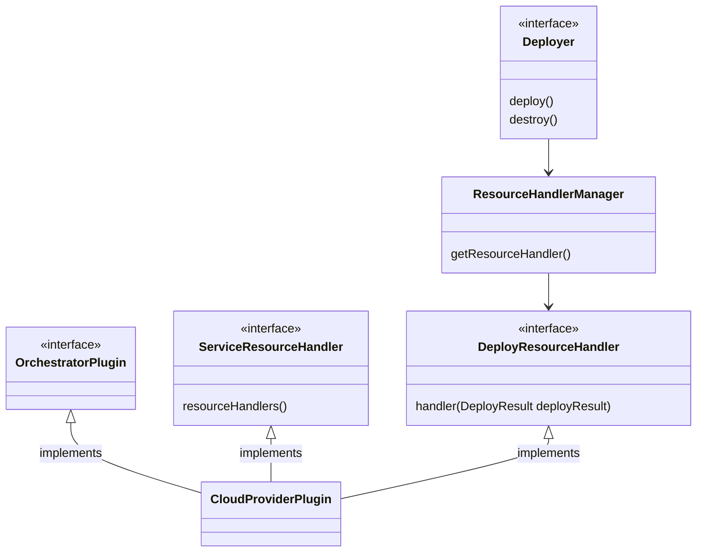

# Service Deployment

import Link from '../src/components/link/Link';

export const DEPLOY_RESOURCE_HANDLER_INTERFACE =
    'https://github.com/eclipse-xpanse/xpanse/blob/main/modules/orchestrator/src/main/java/org/eclipse/xpanse/modules/orchestrator/deployment/DeployResourceHandler.java';
export const DEPLOYER_INTERFACE =
    'https://github.com/eclipse-xpanse/xpanse/blob/main/modules/orchestrator/src/main/java/org/eclipse/xpanse/modules/orchestrator/deployment/Deployer.java';
export const DEPLOY_RESULT_MODEL =
    'https://github.com/eclipse-xpanse/xpanse/blob/main/modules/models/src/main/java/org/eclipse/xpanse/modules/models/service/deploy/DeployResult.java';

xpanse aims to unify the service deployment on any cloud by re-using already available cloud infrastructure management tools such
as Terraform, OpenTofu, Pulumi, etc., in the market.

Service Deployment involves the following tasks

1. The service provider must provide the script that must be executed to create the cloud resources
   required for running the service. The script must be provided as part of the service template.
2. Install the software and configurations needed for running the service.

> Note: At the moment, Terraform and OpenTofu is supported by xpanse for service deployment. We plan to add support for other
> deployment tools in the upcoming releases.

## Deployer Implementation

Every deployer must implement the methods defined in the <Link name={'Deployer'} url={DEPLOYER_INTERFACE}/> interface.
The deployer implementation will abstract all the service deployment tasks that must be executed for provisioning the service and return the result as <Link name={'DeployResult'} url={DEPLOY_RESULT_MODEL}/> object.

### Processing Deployment Results

Each deployer can put all the necessary information about deployment results to a `privateProperties` map in `DeployResult` object.

#### Resource Handlers

Each plugin must implement a <Link name={'DeployResourceHandler'} url={DEPLOY_RESOURCE_HANDLER_INTERFACE}/> for each `DeployerKind` and this will be invoked to extract the cloud resources deployed from the `DeployerResult`.

## Asynchronous Processing

Since a service deployment can take longer depending on the complexity of the service and the resources required for it,
the entire deployment process is implemented to run asynchronously.

After the `deploy` or the `destroy` request is submitted, the runtime validates the request and the client receives an
accepted/rejected message synchronously. After this, the runtime hands over the deployment request to another thread which executes the deployment independently.

The clients can then fetch the status of the deployment using `getDeployedServiceDetailsById` service.

## Terraform

Terraform script that must be executed must be passed as is, in the service definition when the service is registered.
You can find examples of how the script can look like in
the <Link name={'samples'} url={'https://github.com/eclipse-xpanse/xpanse/tree/main/samples'}/> folder.

> **Terraform** binaries must be installed on the system where the runtime is running. Or use our docker image, which
> contains all required software pre-installed.

### Terraform Boot

To offload the service deployment tasks from the xpanse's main runtime engine, we created a project called <Link name={'terraform-boot'} url={'https://github.com/eclipse-xpanse/terraform-boot'}/>.
We used this application for all our Terraform related tasks.

## OpenTofu

OpenTofu script that must be executed must be passed as is, in the service definition when the service is registered.
You can find examples of how the script can look like in
the <Link name={'samples'} url={'https://github.com/eclipse-xpanse/xpanse/tree/main/samples/develop'}/> folder.

> **OpenTofu** binaries must be installed on the system where the runtime is running. Or use our docker image, which
> contains all required software pre-installed.

### Tofu Maker

To offload the service deployment tasks from the xpanse's main runtime engine, we created a project called <Link name={'tofu-maker'} url={'https://github.com/eclipse-xpanse/tofu-maker'}/>.
We used this application for all our OpenTofu related tasks.

### Script Validation

As part of the service registration process, xpanse validates the syntax of the Terraform script provided. The service
is registered only when the script validation is successful.

We use the Terraform <Link name={'validate'} url={'https://developer.hashicorp.com/terraform/cli/commands/validate'}/> feature to achieve
this.

### Script Execution

When the customer orders the service, the following happens

1. Generate a unique ID for the service requested. This is based on UUID.
2. Create a folder with this ID as the name.
3. From the runtime, call the start the Terraform process outside the JVM to do the following

-   Inside the folder, the runtime will then create a Terraform workspace.
-   Execute the Terraform scripts

> Note: To avoid dependency on the filesystem, the state `terraform.tfstate` file contents are copied to the database at
> the end of the service deployment. We reuse this later when the customer requests to destroy the service.

### Reading Script Output

After the runtime starts the Terraform script as a system command, it then starts to listen to `stdout` and `stderr` of
the job to gather all output generated from the script.

### Capturing Service Details

For any service ordered by the customer, it's important to return the details of the ordered service. Such as the IP addresses,
credentials, etc. which the customer must use to start consuming the service.

We use the
Terraform `output` <Link name={'feature'} url={'https://developer.hashicorp.com/terraform/tutorials/configuration-language/outputs'}/> to get
such information from the service deployment. So it's important to add the `output` section to the scripts. The same
is also used by the xpanse UI for displaying the service details.
