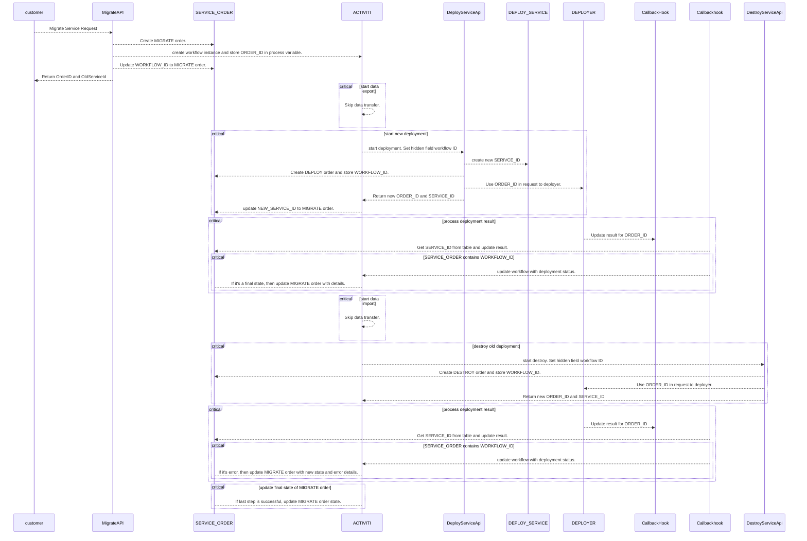

# Service Portability

Service portability is the process of migrating a running service and its data from one cloud service provider to another
service provider.

xpanse implements the service portability using a workflow engine, which supports two different use cases

1. Port service between two different regions with the same cloud service provider.
2. Port service between two different cloud service providers.

